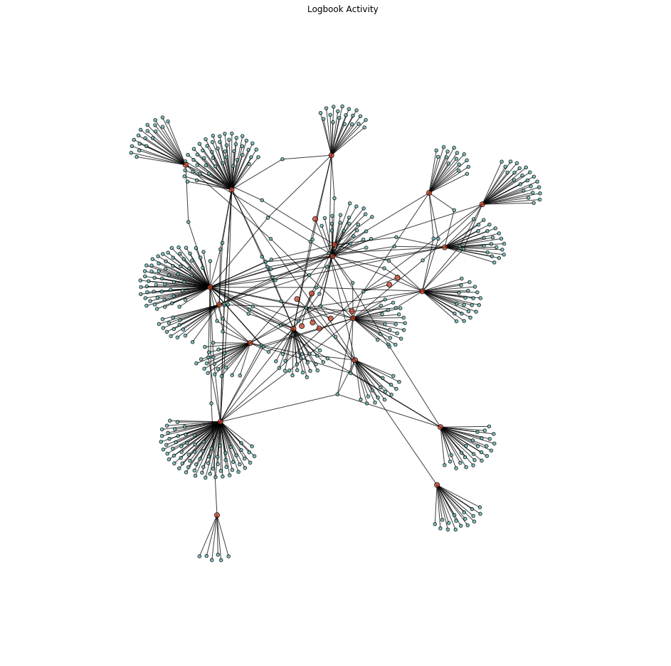

# Logbook Blocking

**A blocking methodology for suggesting pairwise comparisons in the logbook dataset.**

## About

This project is part of the District Data Research Labs on Entity Resolution.

### Dataset

The dataset is a denormalized set of subject, predicate, object (SPO) triples relating to how people participate in District Data Labs. For example, the triple:

    (Benjamin Bengfort, taught, Introduction to Machine Learning)

Expresses the relationship between an entity, &ldquo;Benjamin Bengfort&rdquo;, and a workshop, &ldquo;Introduction to Machine Learning&rdquo; &mdash; namely that he taught it. The entire dataset of triples form a social activity network: e.g. there is a relationship from the instructor, in this example triple, and any person that took the workshop in other associated triples. Together this dataset represents a Graph of the activity at DDL.

Because DDL is about humans, the subject is a human person that must be identified. We have two primary pieces of information about subjects: their name and email. Because the predicate and object are directly related and can generically be about anything, we identify them as the `Action` and `Detail`. Finally, we also track the date of the action as well as the IPAddress if the action was pulled from the web.

### Goal

The problem is that the entities, both objects and subjects can be ambiguous. For example, &ldquo;Benjamin Bengfort&rdquo; might be reported as &ldquo;Ben Bengfort&rdquo;. Moreover, what about the difference between the following two entities:

    jsmith@example.com, John Smith
    johnsmith@gmail.com, John Smith

Are they the same or are they different people?

The goal of this project is to provide a blocking method to have an annotator proposed pairs of entities in the data set, such that they can say whether or not they are the same person, in order to create a supervised method of deduplication.

## Approach 1: Graph Based Blocking

The first approach, prepared by [@bbengfort](https://github.com/bbengfort) uses a graph structure to propose pairwise comparisons. The idea is that the underlying data structure will not allow duplicates inside of relationships. That is, if John Smith <jsmith@example.com> registers for a course, and so does John Smith <johnsmith@gmail.com>; then they're definitely different people (otherwise they paid money twice?).

While the semantics of this approach might not be globally consistent for all relationships (e.g. these entities may be the same and have both subscribed to the same RSS feed). It does push the problem back to an edge duplication problem, which might be easier, since there are far fewer edges between nodes. Moreover, it gives us the opportunity to compare entities across relationships and add other semantics. E.g. prerequisites: you cannot take the Machine Learning course unless you've had the Building Data Apps course.
